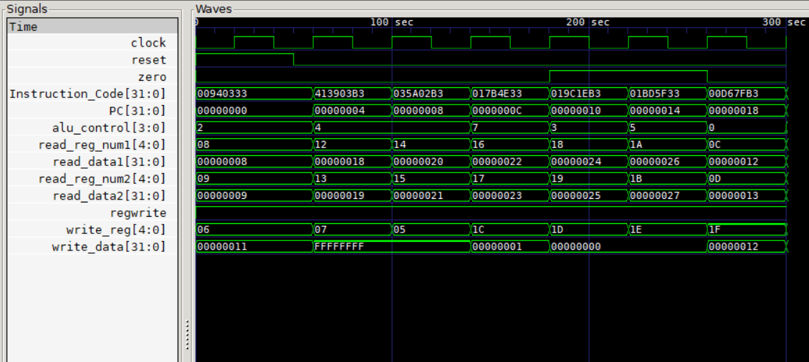

# RISC-V Processor

## Table of Contents
- [About the Project](#about-the-project)
- [Project Structure](#project-structure)
- [Tools Used](#tools-used)
  - [iVerilog](#iverilog)
  - [GTKWave](#gtkwave)
- [Getting Started](#getting-started)
  - [Setting Up Instructions](#setting-up-instructions)
  - [Initializing the Register File](#initializing-the-register-file)
  - [Running the Processor](#running-the-processor)
  - [Viewing Waveform](#viewing-waveform)

## About The Project
This project implements a 32-bit RISC-V ISA-based processor in Verilog. The sub-modules used in the design and their interactions are illustrated in the following diagram:

<p align="left">
  
</p>


### Output waveform using GTKWave:
<p align="left">
  
</p>


## Project Structure
The repository is structured as follows:
- Each sub-unit has its own folder at the root of the repository.
- Each sub-unit folder contains:
  - The modules used in that particular unit.
  - A testbench and waveform files used for testing and debugging.
- The final processor implementation is in the **Processor** folder.
  - This integrates all relevant sub-units to create a fully functional processor.

## Tools Used
### iVerilog
Icarus Verilog (iVerilog) is used as the Verilog compiler for this project. It is an open-source, robust, and user-friendly tool with regular updates. More details can be found in the [official wiki](https://iverilog.fandom.com/wiki/Installation_Guide).

### GTKWave
GTKWave is a powerful open-source tool used to view `.vcd` and other waveform files. It is essential for debugging and analyzing signal dependencies in the processor design.

## Getting Started
Follow these steps to set up and run the project locally.

### Setting Up Instructions
Before running the processor, initialize the instruction memory with the desired sequence of instructions. By default, 8 instructions are included that execute sequentially as per the initialization.

### Initializing the Register File
For instruction execution, registers must contain values. The register file is pre-initialized such that each register holds a value equal to its register number minus one.
- Example: Register `x14` will have an initial value of `13`.

### Running the Processor
After setting up the instruction memory and register file, compile the testbench:

```sh
iverilog -o gen-compiled Processor_tb.v
```

This generates a compiled file named `gen-compiled`. Execute the compiled file using:

```sh
vvp gen-compiled
```

### Viewing Waveform
The waveform generated from the testbench is saved as `output_wave.vcd`. Use GTKWave to view the waveform:

```sh
gtkwave output_wave.vcd
```


